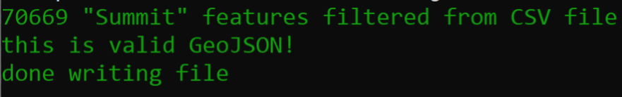

# us-national-peaks
## Practice utilizing turf.js library using US National Peak Data
https://rcramsey.github.io/us-national-peaks/

Created to fulfull project requirements for MAP675. Process for project creation below.
Download NationalFile from [here](website) as zipped file of all individual state features.
Unzip in project-files directory. 
- Confirm *project-files* included in *.gitignore*

### Write node script to pull data from large file (csv to json to geojson)
1. Import the required packages
2.  Declare variables for accessing in and out file paths, and the feature class attribute to filter out (summits)
3. Use csvtojson package to request original data file
4. Filter and convert JSON object to GeoJSON, validate, and write to file.

### Initializing npm and installing npm packages
- In Command Prompt initialize npm   
```bash 
npm init
```  
- Confirm package.json created for npm 

- Revise description of package.json as needed

- Install four npm packages:
    ```bash
    npm install @turf/turf
    npm install chalk
    npm install csvtojson
    npm install geojson-validation
    ```
- Confirm *node_modules* for dependencies were pulled and included in *.gitignore*

- Downgrade chalk dependency to 4.1.2 (latest version 5.0 throws require error as is now ESM)

### Run build script from within build-script folder to create us-summit.json within data folder.     
```bash
node process-csv-national-summit.js
```  
Command Prompt Response  

*Node summit response in command prompt*  

Initial NationalFile data from website as txt file size: 315 MB
After filter txt for summits in form of csv to json to geojson: 9.33 MB

### Write node script to build a hexgrid from 1000s of points
1. Use Turf's `turf.hexGrid()` method to create a set of polygons over a given bounding box, each of the same size (cellSide 0.25 degrees), and
2. Use Turf's `turf.booleanPointInPolygon()` method to do a point-in-polygon analysis to determine how many points exist within each polygon
3. Use one of Turf's methods `turf.featureEach`to loop through features in a similiar way as JavaScript's `forEach()` method loops through an array.
4. Use the `turf.trucate()` method to trim the coordinate precision of output GeoJSON file and reduce file size further.
5. Write the output GeoJSON of hexagons to file.
6. If not too large check in geojson.io

### Run build script from within build-script folder to create us-summit.json within data folder.     
```bash
node create-hex-summit.js
```  

Initial NationalFile data from website as txt file size: **315 MB**   
After filter txt for summits in form of csv to json to geojson: **9.33 MB**  
Newest file (one count property for each polygon/hexagon feature): **1.85 MB**

### Write index.html code
1. Use d3.js library to fetch data
2. Use leaflet to display
    - `L.geoJson()` method to filter to exclude hexagons with zero counts from layerGroup object created
3. Use native/vanilla js to 
    - loop through data and push count data on
    - use Chroma library to colorize
        - request *chroma.min.js*
        - use chroma to determine class breaks of full data set
        - create `colorize` generator function 
    - create tooltips
    - listen for eventlisteners
